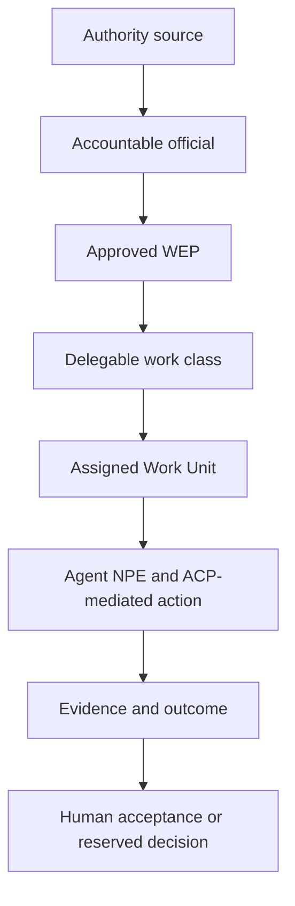
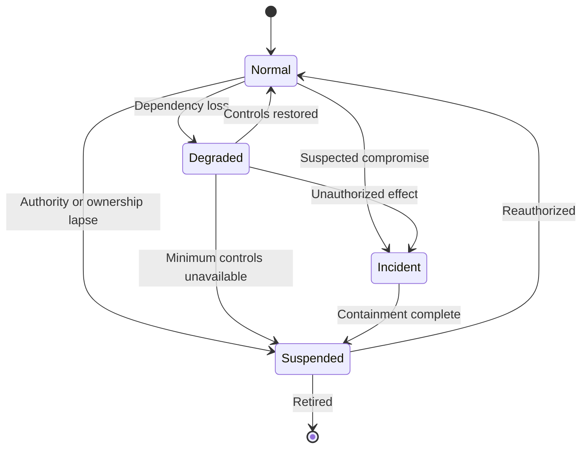

## Executive Argument

The Department's next agentic problem is not access to models. It is institutional employment. The **agentic information enterprise** is the resulting mixed human-and-software operating environment: non-person agents receive bounded work through common identity, authority, assurance, acceptance, and performance mechanisms.

Software can now receive tasking, retrieve authoritative information, invoke tools, maintain context, and act across enterprise systems. Procurement alone does not determine what work may be assigned, which decisions remain human, how outputs become authoritative, what evidence survives, or who remains accountable.

That gap separates productivity from force creation. A copilot helps a person perform existing work. An employed agent becomes additional assignable capacity: it receives bounded Work Units, operates through a durable non-person identity, uses approved data and tools, produces evidence, escalates exceptions, and returns work through a defined acceptance path. It remains software. It does not occupy a billet, hold public office, accept governmental risk, issue policy, or acquire independent decision authority. Workforce creation is an operating model, not a grant of legal personhood.

This paper proposes that operating model for the DoD Information Enterprise. It is the institutional layer above the Agent Control Plane Reference Architecture (ACP-RA) and Continuous Assurance Fabric Reference Architecture (CAF-RA). ACP determines what technical controls permit an agent to attempt, through which tools, under bounded technical permissions and retained Government authority. CAF preserves and evaluates evidence of the resulting behavior. The workforce operating concept determines what work the agent receives, who supervises and accepts it, how its net capacity is measured, and when it is scaled, constrained, or retired.

The model rests on three constructs:

- A **Workforce Employment Profile** defines the mission function, eligible Work Units, identity, sponsor, tools, data, supervision, reserved human decisions, resource budget, evidence, and retirement conditions for an agent.
- An **Authority and Responsibility Graph** preserves the traceable chain from governing authority to accountable official, delegated work, agent action, evidence, and human acceptance.
- A **Capacity Ledger** determines whether the deployment created useful throughput after supervision, assurance, rework, platform, and sustainment burdens are counted.

DoW CIO is the correct proving ground. Its responsibilities for enterprise architecture, cybersecurity, identity, records, IT investment, policy, and the digital workforce contain evidence-heavy staff work that is consequential but decomposable, reviewable, and largely reversible. Agents can trace policy impacts, evaluate architecture conformance, prepare continuous-monitoring and authorization evidence, analyze portfolio data, and surface exceptions. Humans retain issuance, waiver, certification, authorization, investment, and risk decisions.

The Department will create agentic capacity either deliberately or by accumulation, one local workflow, vendor feature, and service account at a time. The choice is whether that capacity enters the information enterprise as governed force creation or as an unmanaged shadow workforce.

## 1. From Agent Control To Institutional Employment

This paper uses current Department of War office titles. Legacy DoD issuance titles and the established term **DoD Information Enterprise** are retained as published.

[Code-as-Policy](https://www.adamboas.com/writing/code-as-policy/) makes governance executable. [Force Creation](https://www.adamboas.com/writing/agentic-force-creation/) identifies the strategic opportunity. [ACP-RA](https://www.adamboas.com/writing/acp-ra/) defines governed bounded action. [CAF-RA](https://www.adamboas.com/writing/caf-ra/) preserves and evaluates evidence of behavior. This operating concept supplies the institutional layer: how the Department assigns agent work and incorporates accepted results into mission processes.

A **Work Unit** is a bounded task thread with an authoritative source, assigned outcome, permitted actions, acceptance criteria, accountable owner, and recorded closure. It is the unit of assignment, evidence, supervision, and performance, not the agent, token, tool call, or operating hour.

The [2026 Artificial Intelligence Strategy for the Department of War](https://media.defense.gov/2026/Jan/12/2003855671/-1/-1/0/ARTIFICIAL-INTELLIGENCE-STRATEGY-FOR-THE-DEPARTMENT-OF-WAR.PDF) designates Enterprise Agents as one of seven Pace-Setting Projects. Each PSP has a program leader and sponsoring organization; the Chief Digital and Artificial Intelligence Officer (CDAO) enables the projects, establishes common metrics, and provides foundational enablers. The strategy directs CDAO and the CIO to use their respective authorities for capability delivery, including cross-domain data access and rapid authorization-to-operate (ATO) reciprocity, while the Under Secretary of War for Research and Engineering (USW(R&E)) operates the Barrier Removal Board. It does not designate CIO or CDAO as the sole Enterprise Agents owner. DoW CIO's [Fulcrum strategy](https://dodcio.defense.gov/Portals/0/Documents/Library/FulcrumAdvStrat.pdf) supplies the information-enterprise context across warfighting IT, networks and compute, governance, and the digital workforce.

Commercial platforms confirm the direction. [Microsoft Agent 365](https://www.microsoft.com/en-us/microsoft-agent-365), [Workday's Agent System of Record](https://newsroom.workday.com/2025-02-11-The-Next-Generation-of-Workforce-Management-is-Here-Workday-Unveils-New-Agent-System-of-Record), [ServiceNow AI Control Tower](https://www.servicenow.com/products/ai-control-tower.html), and [AWS AgentCore Policy](https://docs.aws.amazon.com/bedrock-agentcore/latest/devguide/policy.html) are normalizing identity, sponsorship, lifecycle, policy enforcement, observability, and cost control. The [NIST AI Agent Standards Initiative](https://www.nist.gov/news-events/news/2026/02/announcing-ai-agent-standards-initiative-interoperable-and-secure) is advancing agent interoperability and security.

Those capabilities are necessary but no longer distinctive. The Department's remaining problem is binding them to governmental authority, reserved decisions, mission acceptance, records, risk, enterprise architecture, and public accountability. ACP mediates authority. CAF preserves and evaluates evidence of behavior. The workforce operating concept determines whether the resulting work has earned institutional acceptance and continued employment.

## 2. The Institutional Boundary

An agent is software. Treating software with durable identity, assigned work, enterprise access, bounded tool permissions, and persistent context as workforce capacity is an operating model, not legal personality, employment status, public office, command authority, or independent governmental discretion.

Agents do not occupy billets, count toward end strength, or become members of the Total Force under [DoDD 5124.02](https://www.esd.whs.mil/Portals/54/Documents/DD/issuances/dodd/512402p.PDF). Non-person entity (NPE) identity establishes technical accountability, not institutional authority. The question is what work may be assigned, which effects are permitted, and who accepts the result.

### Reserved Human Authority

Tasking applies to work and bounded technical actions. It does not transfer governmental office. Agents may prepare evidence, synthesize sources, identify conflicts, draft products, route work, and perform reversible actions when authorized. They may not independently exercise authorities assigned by law, regulation, policy, warrant, command, or appointment.

| Decision or effect                                                      | Agent role                                                    | Required human role                                                                                                                                                      |
| ----------------------------------------------------------------------- | ------------------------------------------------------------- | ------------------------------------------------------------------------------------------------------------------------------------------------------------------------ |
| Policy issuance or authoritative interpretation                         | Trace sources, draft language, identify impacts and conflicts | Authorized official interprets, approves, and issues policy                                                                                                              |
| Cybersecurity authorization or risk acceptance                          | Assemble evidence, test completeness, identify exceptions     | The Authorizing Official (AO), who must be Government personnel, determines whether system risk is acceptable and approves, denies, conditions, or revokes authorization |
| Architecture standard, certification, or waiver                         | Evaluate conformance and prepare supporting material          | Authorized official decides and executes the act                                                                                                                         |
| Contractual action                                                      | Prepare and validate supporting material                      | A contracting officer acting within the limits of a valid warrant executes the contractual action                                                                        |
| Personnel, adjudicative, disciplinary, command, or operational decision | Organize evidence and provide bounded decision support        | Authorized human decides, directs, and signs                                                                                                                             |
| Official external communication                                         | Draft, validate, and route the communication                  | Authorized human approves transmission unless a bounded service notification is preauthorized                                                                            |

[FAR Subpart 7.5](https://www.acquisition.gov/far/subpart-7.5) is a useful contractor-focused analogy, not a direct rule for software. If an effect depends on the office, judgment, certification, risk acceptance, or accountability of an authorized person, an agent may support but cannot hold that authority.

Completion means the agent satisfied technical exit criteria. Closure means the designated acceptance mechanism accepted, rejected, corrected, or escalated the result. Reserved decisions always require the authorized human official. Automated acceptance is permissible only for explicitly preauthorized, non-reserved, bounded effects with a named accountable owner and tested exception path.

## 3. DoW CIO As The Proving Ground

DoW CIO is not the sole owner of the Department's agentic workforce, but it is the correct enterprise proving ground. [DoDD 5144.02](https://www.esd.whs.mil/Portals/54/Documents/DD/issuances/dodd/514402p.pdf) assigns the CIO responsibilities spanning the information enterprise, architecture and standards, cybersecurity, interoperability, records and information management, IT investment, and the IT and cyber workforce. Those responsibilities contain the precise combination of evidence, coordination, policy, and review work needed to demonstrate governed force creation.

The proving-ground approach is deliberate. DoW CIO can validate the operating model against its own mission responsibilities, establish reusable enterprise patterns with CDAO and the Components, and avoid claiming ownership over mission functions assigned elsewhere. The initial objective is not a universal agent workforce. It is an evidence-backed method that can be generalized after it works.

| DoW CIO responsibility                                                                                    | Candidate Work Unit                                                                  | Agent contribution                                                                          | Reserved human act                                                                                                                                                                                | Acceptance evidence                                                             |
| --------------------------------------------------------------------------------------------------------- | ------------------------------------------------------------------------------------ | ------------------------------------------------------------------------------------------- | ------------------------------------------------------------------------------------------------------------------------------------------------------------------------------------------------- | ------------------------------------------------------------------------------- |
| Enterprise architecture and standards                                                                     | Evaluate an architecture package against applicable standards                        | Build source traceability, identify deviations, and draft conformance findings              | Establish, interpret, or waive standards                                                                                                                                                          | Source-linked findings and approved disposition                                 |
| Cybersecurity, identity, credential, and access management (ICAM), zero trust, and authorization evidence | Evaluate identity, access, evidence currency, and control coverage                   | Map requirements; identify missing, stale, excessive, or conflicting evidence and access    | CIO establishes ICAM policy and standards and approves enterprise authoritative attribute services; system and resource owners define and enforce access; the AO makes the authorization decision | Conformance map, exceptions, and accountable decision                           |
| Software, cloud, infrastructure, and IT portfolio modernization                                           | Assess implementation, cost, performance, duplication, risk, and strategic alignment | Trace outcomes and dependencies; surface technical debt, anomalies, and barriers            | Set priorities; certify, modify, or terminate investments; direct corrective action                                                                                                               | Accepted assessment and decision record                                         |
| Policy and guidance                                                                                       | Assess the impact of new authorities or guidance                                     | Trace affected issuances, systems, organizations, and obligations; draft changes            | Officially interpret, coordinate, approve, and issue policy                                                                                                                                       | Authoritative source trace and approved issuance                                |
| Records and information management                                                                        | Identify candidate records and disposition requirements                              | Apply approved metadata and tagging rules, preserve provenance, and route records questions | Records officials validate treatment and apply approved schedules; new or changed schedules require NARA approval                                                                                 | Applicable disposition authority, hold status, and records-official instruction |

These Work Units share five useful properties: the authoritative sources can be identified; the work can be decomposed; evidence quality can be tested; human decision rights can be preserved; and rejected outputs can usually be corrected without irreversible mission effect. That makes them a stronger first edge than public communication, autonomous personnel action, financial commitment, or operational command.

The mission map identifies eligible demand. The workforce operating model converts that demand into bounded employment.

## 4. The Workforce Operating Model

The operating model does not create a parallel technical architecture. It binds mission employment to ACP and CAF through three institutional artifacts and a supporting registry.

### 4.1 Workforce Employment Profile

The **Workforce Employment Profile (WEP)** is the authoritative management description of employment, not an independent source of authority. It defines work, ownership, technical boundaries, acceptance, economics, and lifecycle.

At minimum, the WEP includes:

- **Purpose and work:** mission outcome; eligible, prohibited, and exception-only Work Units; priority and closure rules.
- **Ownership and authority:** sponsor, mission owner, supervisor, technical and sustainment owners, data steward, reserved decisions, and accepting officials.
- **Identity and operating boundary:** blueprint, deployment, and runtime identities; tools, data, systems, models, environments, communications, effects, consequence, reversibility, and exposure.
- **Control and supervision:** Trust Scope Manifest, policy bundle, Model Assurance Profiles, approval and sampling rules, evaluation, escalation, and degraded operation.
- **Resources and evidence:** duty cycle, concurrency, cost and compute budgets, Action Envelopes, Evidence Ledger, records, privacy, and retention.
- **Lifecycle:** change control, authorization status, review and expiration dates, renewal criteria, suspension, transfer, and retirement.

The WEP references rather than reproduces technical artifacts: ACP enforces the trust scope and policy; CAF binds actions, sources, outputs, exceptions, and approvals to evidence.

### 4.2 Authority And Responsibility Graph

The **Authority and Responsibility Graph (ARG)** makes the source, delegation, execution, and acceptance of agent work queryable. It prevents authority from disappearing into a prompt, service account, orchestration script, or vendor configuration.



For every production Work Unit, the ARG should answer:

- What authority and official generated the work?
- Which employment, tasking, identity, model, tool, data, and credential conditions governed execution?
- Which actions and effects occurred, what evidence supports them, and who accepted the result?
- Which change, revocation, performance, or incident altered future employment?

The WEP narrows employment but does not originate authority. The ARG is a canonical relationship model resolved from policy, ICAM, tasking, ACP, CAF, and acceptance records, not necessarily a monolithic new database. It should be materialized where consequence, oversight, or audit needs justify it and remain traversable from an institutional decision to its contributing work, or from an agent action back to its authority and accepting official.

### 4.3 Capacity Ledger

The **Capacity Ledger** links mission demand, accepted Work Units, human burden, platform cost, and risk. Capacity exists when throughput against a declared quality standard increases without equal or greater supervision, correction, assurance, platform, and incident burden. For comparable work, the ledger separately reports net human capacity released, cost, quality, timeliness, risk, and newly created throughput.

Agent-hours, tokens, autonomy percentages, and raw completion are operating telemetry. They are not force-creation measures. Reviewer acceptance alone is also insufficient when the product fails a predeclared quality standard.

### 4.4 Agent Registry

The supporting registry records deployment, lifecycle, owners, identity, WEP, trust scope, approved models and tools, environment, review, and retirement. It integrates with ICAM, configuration, authorization, records, financial, and service-management systems. Unregistered agents receive no production access; agents without a current WEP or resolvable ARG receive no production Work Unit.

The WEP defines employment, the ARG traces authority and acceptance, and the Capacity Ledger determines whether the deployment should continue.

## 5. Concept Of Operations

The CONOPS follows work from demand through acceptance and retirement. It does not assume that higher autonomy is the objective. The objective is to create dependable capacity at the lowest operating authority and supervision burden that satisfies the mission.

### 5.1 Operating Lifecycle

1. **Define demand and work.** Establish the backlog, mission quality standard, baseline burden, authoritative sources, delegable tasks, and reserved decisions.
2. **Design and evaluate employment.** Create the WEP and ARG; test representative and adversarial Work Units, policy enforcement, evidence, degraded operation, revocation, and rollback in a sandbox.
3. **Complete required approvals.** The mission owner approves employment; designated identity and account authorities provision identity and accounts; system and control owners implement controls; the AO makes authorization decisions; other domain owners act within assigned authority.
4. **Assign, execute, and accept.** A human or approved deterministic rule assigns the Work Unit. ACP mediates consequential actions, CAF preserves and evaluates evidence, and the designated human or preauthorized acceptance mechanism closes the work.
5. **Measure and review change.** Record mission, burden, cost, control, workforce, and capacity outcomes. Changes to mission, work, models, tools, data, effects, supervision, authority, or permissions enter applicable change control.
6. **Suspend or retire.** Stop tasking, revoke action credentials, freeze or transfer open work, preserve required evidence, complete records and closeout obligations, and archive the employment decision.

### 5.2 Operating States

The registry separates lifecycle status from runtime operating state. Fielding gates authorize lifecycle transitions; operating conditions trigger normal, degraded, suspended, or incident-contained states.

| State                  | Entry condition                                                                 | Permitted behavior                                                  | Exit requirement                                                 |
| ---------------------- | ------------------------------------------------------------------------------- | ------------------------------------------------------------------- | ---------------------------------------------------------------- |
| **Normal**             | Required authority, controls, owners, services, and evaluations are current     | Perform Work Units inside the WEP                                   | Continue while minimum conditions hold                           |
| **Degraded**           | A dependency or quality signal weakens without evidence of compromise           | Narrow to the approved profile; continue only with durable evidence | Restore the dependency and revalidate queued work                |
| **Suspended**          | Authority, ownership, controls, or performance become invalid                   | Stop tasking and action sessions; revoke credentials; freeze work   | Correct and reauthorize, or retire                               |
| **Incident-contained** | Suspected compromise, unauthorized effect, identity misuse, or evidence failure | Isolate, revoke, preserve evidence, and identify dependent actions  | Complete impact analysis, then suspend pending recovery approval |

An exception pauses and routes the affected action without necessarily changing deployment state. Every state transition records its trigger, authority, affected work, changed access, preserved evidence, and restoration conditions. Without a safe degraded profile, degradation becomes suspension; queued actions do not replay automatically.



### 5.3 Worked Mission Thread: Policy-Impact Agent

DoW CIO policy work is an appropriate first mission thread because it is evidence-heavy, source-dependent, reviewable, and naturally compatible with Code-as-Policy. The agent increases the speed and completeness of policy analysis without acquiring authority to interpret, issue, waive, or enforce policy.

The WEP authorizes impact assessments, conflict analysis, traceability updates, and non-authoritative policy drafts. A DoW CIO policy director owns the mission; a qualified policy lead supervises; an authorized official accepts the analysis. The agent may read allowlisted sources and create internal drafts, branches, tasks, and input requests. It cannot interpret, issue, sign, publish, rescind, waive, or merge authoritative policy; accept risk; direct Component compliance; or communicate an official position.

The mission thread operates as follows:

| Stage                           | Agent and control-plane activity                                                                                                         | Retained human decision                                                                                                                | Closure evidence                                                                                   |
| ------------------------------- | ---------------------------------------------------------------------------------------------------------------------------------------- | -------------------------------------------------------------------------------------------------------------------------------------- | -------------------------------------------------------------------------------------------------- |
| **1. Intake and assignment**    | Validate an allowlisted event or submission; create an intake candidate; resolve identity, WEP, ARG, policy, model, and budget           | Confirm priority, scope, accepting official, and assignment                                                                            | Source snapshot and hash, intake decision, active Work Unit, and controls                          |
| **2. Scope and retrieve**       | Extract apparent obligations and retrieve the current authorized corpus under access, releasability, version, and freshness rules        | Determine binding meaning and approve privileged or out-of-scope expansion                                                             | Corpus manifest, paragraph references, exclusions, uncertainty, and escalation                     |
| **3. Analyze impacts**          | Trace requirements to responsibilities, policies, systems, organizations, and actions; test claims, citations, contradictions, and scope | Resolve materiality, conflicts, institutional position, and priority                                                                   | Traceability matrix, rationale, confidence, and unresolved questions                               |
| **4. Draft and assure**         | Prepare the impact brief, decisions, tasks, and non-authoritative change branch; ACP mediates actions and CAF evaluates evidence         | Select required legal, cyber, architecture, acquisition, privacy, records, and executive reviews                                       | Draft, diff, Action Envelopes, evaluations, provenance, and exceptions                             |
| **5. Review and decide**        | Present the version-bound evidence package and alternatives                                                                              | Accept, reject, correct, or return the analysis; separately authorized officials sign, merge, publish, waive, rescind, or issue policy | Reviewer role, edits, rationale, approvals, and final artifact                                     |
| **6. Follow through and close** | Create approved actions, monitor dependencies, assemble the package, identify candidate records, and update performance                  | Accept closure; validate records treatment; decide scale, constraint, transfer, redesign, or retirement                                | Action results, accepted product, records instruction, cost, performance, and capacity disposition |

## 6. Control, Assurance, And Risk

The CONOPS describes how work moves. ACP and CAF make its authority and evidence enforceable without creating a competing control vocabulary.

| Control artifact                                   | Employment function                                                                               | Required question                                                            |
| -------------------------------------------------- | ------------------------------------------------------------------------------------------------- | ---------------------------------------------------------------------------- |
| NPE identity, technical-actor chain, and Work Unit | Distinguish the deployment, sponsor, runtime principal, assignment, expected outcome, and closure | Who acted, for whom, on what bounded task?                                   |
| Trust Scope Manifest and policy bundle             | Encode authority, environment, consequence, tools, data, budgets, and escalation                  | What may this agent attempt under current conditions?                        |
| Action Envelope                                    | Represent a proposed or completed tool use, communication, state change, or artifact creation     | What was attempted, under what policy, with what expected and actual effect? |
| Model Assurance Profile                            | Bind approved model endpoints, data boundaries, usage modes, evaluations, and limitations         | Was this model approved for this Work Unit, environment, and data?           |
| Evidence Ledger                                    | Preserve sources, actions, outputs, exceptions, evaluations, approvals, and dispositions          | Can the organization reconstruct and defend the result?                      |

### 6.1 Effective Authority

Agent employment intersects mission tasking, access, system authorization, data use, records, privacy, and acquisition. A mission owner can assign work but cannot independently grant access, accept cyber risk, alter a records schedule, approve a PIA, or bind the Government. Machine authority is therefore a control-plane abstraction for bounded technical permissions under retained Government authority.

**Effective Technical Permission = Applicable Authority and Mission Rules ∩ Approved Tasking ∩ WEP ∩ System Authorization ∩ Trust Scope Manifest ∩ Work Unit ∩ Data-Use and Information-Handling Rules ∩ Runtime Policy**

The first two terms establish the institutional basis for the work. The remaining terms constrain technical execution; none can enlarge that basis.

Three invariants apply:

1. Every consequential action resolves to authoritative mission rules and an accountable official; an agent cannot originate authority.
2. Technical permissions narrow downstream, never expand, and revocation propagates to dependent actions and Work Units.
3. Generation and acceptance remain separate; the producing identity cannot represent that an official accepted, signed, certified, or issued the result.

### 6.2 Multidimensional Risk Classification

A single autonomy ladder is insufficient. Autonomy, consequence, data sensitivity, reversibility, exposure, and human control are independent. A drafting agent can mishandle highly sensitive data; a deterministic workflow can make an irreversible change; an adaptive agent can operate safely in a read-only sandbox.

Each WEP therefore contains a risk vector:

| Dimension           | Required classification                                                                                                                                      |
| ------------------- | ------------------------------------------------------------------------------------------------------------------------------------------------------------ |
| Planning latitude   | Human-selected steps, predefined sequence, bounded multistep planning, or adaptive replanning                                                                |
| Delegation topology | Single agent, fixed approved subagent, bounded team, or dynamic selection; include depth and resource limits                                                 |
| Effect type         | Read; draft or recommend; internal reversible workflow; authoritative state change; external communication; financial or legal commitment; reserved decision |
| Consequence         | Negligible, limited, material, or mission-, safety-, statutory-, or strategic-critical                                                                       |
| Reversibility       | No persistent effect, automated rollback, bounded human recovery, or effectively irreversible                                                                |
| Data boundary       | Classification, CUI/privacy category, releasability, enclave, approved model boundary, residency, and retention                                              |
| Exposure            | Internal system, enterprise internal, partner, public, cross-domain, or contested                                                                            |
| Human control       | Human-performed effect, full review, prior approval, or exception-only supervision inside an approved envelope                                               |

A handling tier may prioritize intake but cannot replace the vector. Each subordinate agent needs a distinct identity and resolvable authority path. Reserved or effectively irreversible decisions cannot use exception-only supervision. Controlled, external, or cross-domain operation needs an approved data, model, tool, environment, release, and retention path. Model confidence never expands authority.

### 6.3 Identity, Credentials, And Communications

Logical identity, deployment identity, runtime credentials, and the assigning sponsor are distinct. Logical identity preserves accountability; deployment identity separates instances; runtime credentials should be scoped and rotated.

When an NPE acts as a general, IT-privileged, or functional-privileged user, [DoDI 8520.04](https://www.esd.whs.mil/Portals/54/Documents/DD/issuances/dodi/852004p.pdf) requires its own identity, credentials provisioned through the DoD PKI NPE issuance portal, and a unique network or application account. Its identifier must not map to a person identity. A service account is an NPE account. An approved workload identity or short-lived-token pattern may supplement these controls, but it does not replace requirements applicable to an NPE acting as a user or permit reuse of human credentials.

Email is not identity. A machine-labeled service endpoint is warranted only when the WEP requires messaging under [DoDI 8170.01](https://www.esd.whs.mil/Portals/54/Documents/DD/issuances/dodi/817001p.pdf); consequential messages disclose the service identity and sponsor and never impersonate an official.

## 7. Decision Rights And Institutional Ownership

No single office owns agent employment. Production use requires concurrent decisions across mission, AI, architecture, identity, cybersecurity, records, privacy, acquisition, and workforce domains. Each decision remains with the official or owner already assigned that authority.

| Actor                                                    | Primary responsibility                                                                                                                                                                                                                                                                                   | Retained boundary                                                                                                                          |
| -------------------------------------------------------- | -------------------------------------------------------------------------------------------------------------------------------------------------------------------------------------------------------------------------------------------------------------------------------------------------------- | ------------------------------------------------------------------------------------------------------------------------------------------ |
| **DoW CIO**                                              | Information-enterprise architecture and standards; ICAM policy, standards, and enterprise authoritative-attribute-service approval; cybersecurity policy and oversight; Senior Agency Official for Records Management (SAORM) functions; IT investment; IT/cyber workforce matters; and CIO-owned pilots | Does not own AI assurance, Component records implementation, procurement, human-capital policy, mission functions, or AO decisions         |
| **CDAO**                                                 | AI and data policy, adoption, evaluation, assurance, enabling services, selective scaling, and PSP enablers and metrics under [DoDD 5105.89](https://www.esd.whs.mil/Portals/54/Documents/DD/issuances/dodd/510589p.PDF)                                                                                 | Coordinates with CIO, A&S, and P&R without replacing their authorities                                                                     |
| **PSP program leader and sponsor**                       | Deliver the Enterprise Agents PSP, demonstrate transition-partner use, report progress, and develop the playbook                                                                                                                                                                                         | PSP status does not displace mission, contracting, privacy, records, ICAM, or RMF authorities                                              |
| **USW(R&E)**                                             | Operate the Barrier Removal Board; coordinate AI/data/analytics records policy and tagging guidance with CIO                                                                                                                                                                                             | Acts only within assigned and delegated authorities                                                                                        |
| **USW(P&R) and Component human-capital officials**       | Human-capital policy, labor relations, training, role design, and workforce transition                                                                                                                                                                                                                   | Agents are not billets, employees, FTEs, end strength, or members of the Total Force                                                       |
| **USW(A&S)**                                             | Acquisition, procurement, and intellectual-property policy and oversight under [DoDD 5135.02](https://www.esd.whs.mil/Portals/54/Documents/DD/issuances/dodd/513502p.pdf)                                                                                                                                | Does not own mission requirements or bind the Government contractually                                                                     |
| **Program manager or requirements owner**                | Requirements, acquisition and IP strategy, data-rights needs, portability, and sustainment                                                                                                                                                                                                               | Cannot bind the Government                                                                                                                 |
| **Contracting officer**                                  | Execute solicitation and contract actions within delegated authority                                                                                                                                                                                                                                     | May bind the Government only within that authority under [FAR 1.602-1](https://www.acquisition.gov/far/1.602-1)                            |
| **Mission or business owner**                            | Select work, define acceptance, appoint supervisors, remain accountable for mission use, and recommend scale or retirement                                                                                                                                                                               | Cannot independently grant access, authorize a system, alter records schedules, approve PIAs, issue legal opinions, or bind the Government |
| **Authorizing Official**                                 | Determine whether system risk is acceptable and approve, deny, condition, or revoke authorization                                                                                                                                                                                                        | Must be Government personnel; the authorization decision cannot be delegated                                                               |
| **System owner, program manager, and control providers** | Implement controls, authorization evidence, change management, and system posture                                                                                                                                                                                                                        | Do not assume the AO's decision                                                                                                            |
| **Privacy officials and Component CIO**                  | Administer privacy controls and review privacy impact assessments (PIAs); the Component CIO or designated reviewing official approves PIAs                                                                                                                                                               | Privacy review is distinct from cyber, records, and legal determinations                                                                   |
| **DoW/Component SAORMs and records officers**            | Establish and implement records programs, schedules, capture, retention, and disposition controls                                                                                                                                                                                                        | New or changed schedules require National Archives and Records Administration (NARA) approval                                              |
| **General Counsel (GC) and servicing counsel**           | Provide legal advice; GC establishes the Department's determinative legal position within assigned scope                                                                                                                                                                                                 | Counsel does not own mission, privacy-program, records-program, or authorization decisions                                                 |
| **Technical owner**                                      | Operate the platform and implement approved controls, access, evidence, incident response, and decommissioning                                                                                                                                                                                           | Technical configuration cannot enlarge mission or governmental authority                                                                   |

Existing architecture, authorization, portfolio, acquisition, records, privacy, and workforce governance should carry these decisions. A new standing board is warranted only where a specific unresolved decision cannot be exercised through existing authority.

Suspension and retirement remain distributed: mission tasking stops; access and authorization are addressed by their owners; records, privacy, legal, acquisition, data, and technical closeout follow their governing requirements. Retirement never authorizes destruction contrary to an approved schedule, hold, freeze, or investigation.

## 8. Information, Records, Cybersecurity, And Acquisition

### 8.1 Evidence Is Not The Same As A Federal Record

The Evidence Ledger supports accountability, but not every prompt, retrieval, intermediate, or telemetry event is automatically a Federal record. Status depends on content, function, use, evidentiary value, and approved disposition authority.

Under [DoWI 5015.02](https://www.esd.whs.mil/Portals/54/Documents/DD/issuances/dodi/501502p.pdf), DoW CIO is the Department's SAORM; Components implement approved programs and schedules; and USW(R&E) coordinates AI-related records policy and tagging guidance with CIO. The WEP separates record copies from supporting evidence, telemetry, transients, privileged material, and incident data. Records, classification, CUI, privacy, and cyber determinations remain distinct.

### 8.2 Privacy And Cybersecurity Remain Independent Control Domains

Privacy obligations arise from processing personally identifiable information (PII), not agent status. The program manager or designee assesses PIA need with security, privacy, and records officials; the Component CIO or designated official approves under [DoDI 5400.16](https://www.esd.whs.mil/Portals/54/Documents/DD/issuances/dodi/540016p.pdf). System of records notice (SORN) analysis applies when information is retrieved by a personal identifier and existing coverage is inadequate or materially changed. [DoDI 5400.11](https://www.esd.whs.mil/Portals/54/Documents/DD/issuances/dodi/540011p.pdf) supplies the broader framework.

An agent capability must be placed within a defined authorization boundary. A component, technology, or external service below the system level does not require a separate ATO solely because it is an agent, but it must complete applicable Assess Only procedures and change control within the system authorization boundary. If the capability constitutes a system, it follows the full Risk Management Framework (RMF). The system owner processes and documents the change; the AO determines whether resulting risk is acceptable and whether authorization or reauthorization is required. Production patterns should combine attributable least-privilege identity, externalized policy enforcement, approved models and tools, isolation, provenance, evaluation, revocation, containment, and rollback.

### 8.3 Acquisition And Portability

Solicitations should require vendor-neutral outcomes rather than compatibility with a privately defined architecture: capability and change disclosure; Government-controlled identity, policy, suspension, and evidence export; portable configuration and lifecycle data; open interfaces; data-use limits; and rights sufficient for mission use, audit, competition, modernization, incident response, records, provider exit, and sustainment.

The Government should not assert blanket ownership of vendor models, background intellectual property, or all telemetry. The program and contracting officer should acquire the deliverables and license rights needed to control and sustain the mission under [DoDI 5010.44](https://www.esd.whs.mil/Portals/54/Documents/DD/issuances/dodi/501044p.pdf).

## 9. Mission Performance And Workforce Legitimacy

Agent employment succeeds only when mission performance improves after full burden is counted. Agent count, uptime, tokens, operating hours, autonomy, and raw completion do not demonstrate force creation.

### 9.1 Measurement Model

Before a pilot, establish a baseline for each comparable Work Unit class: quality, time, human effort, backlog, cost, error, review, and consequence. Previously deferred work is newly created throughput, not assumed human capacity released.

| Measurement area | Required measures                                                                                                 |
| ---------------- | ----------------------------------------------------------------------------------------------------------------- |
| Mission output   | Assigned, accepted, rejected, unresolved, cycle time, backlog, decision latency, and degraded performance         |
| Quality          | Source completeness, material correction, first-pass acceptance, escaped defects, and mission criteria            |
| Human burden     | Supervisor, SME, correction, escalation, and incident minutes per accepted Work Unit                              |
| Cost             | Models, compute, licenses, tools, engineering, operations, assurance, review, rework, and incidents               |
| Control          | Blocked or unauthorized actions, scope violations, evidence gaps, exceptions, reversals, revocation, and rollback |
| Workforce        | Burden reduction, supervisor load, training, workload change, challenge use, and role redesign                    |

Targets derive from baseline and consequence. Scale requires sustained capacity, required quality, acceptable control, and supportable supervision. Volume that transfers equal or greater burden to validators is not capacity.

### 9.2 Supervision As A Designed Function

Supervision manages Work Units, exceptions, evidence, performance, and scope, not every token. The WEP defines supervisor qualifications and capacity, independence, review and approval modes, exception limits, accepting officials, and conditions for narrowing, reassignment, suspension, or reauthorization.

Supervisor capacity is finite. Supervision, evaluation, workflow ownership, policy stewardship, and control-plane operations require explicit training and workload allocation.

### 9.3 Human Capital And Workforce Legitimacy

Workers are rational to worry. Agent rollout can reduce low-value burden, but it can also create opaque surveillance, hidden displacement through delayed hiring or billet pressure, uneven access to augmentation, new validation burdens, and silent increases in expected output.

The answer is not reassurance. It is operating discipline:

- Notify affected personnel when agents materially influence workload, assignment, performance context, or authoritative products; do not silently ratchet productivity expectations.
- Provide paths into supervision, evaluation, workflow design, platform operations, records stewardship, and policy engineering.
- Preserve challenge, correction, and attribution mechanisms; never use agent output as the sole basis for personnel, disciplinary, adjudicative, or opportunity decisions.
- Review surveillance, privacy, accessibility, equal-opportunity, labor, due-process, and workforce-transition implications before scaling.

Agent capacity belongs in mission and resource planning, but not as a fictional headcount equivalent. The useful planning question is how much accepted work the mixed human-agent system can perform at a defined quality, cost, risk, and supervision burden.

## 10. Fielding Strategy

The Department's AI strategy emphasizes speed, experimentation, accountable teams, measurable outcomes, and reimagined workflows. Governance must therefore operate as a paved road, not a sequence of open-ended committee reviews.

Fielding gates organize evidence and lifecycle-transition decisions; they do not create, consolidate, or transfer authority. Each official acts only within the official's assigned domain.

| Gate                      | Minimum evidence and decision                                                                                                                                                                                                                                                                                                                                                                 | Required decision owners                                                                                |
| ------------------------- | --------------------------------------------------------------------------------------------------------------------------------------------------------------------------------------------------------------------------------------------------------------------------------------------------------------------------------------------------------------------------------------------- | ------------------------------------------------------------------------------------------------------- |
| **0. Nomination**         | Demand, baseline, eligible work, reserved decisions, and benefit → reject, redesign, or sponsor sandbox work                                                                                                                                                                                                                                                                                  | Mission owner or prospective sponsor                                                                    |
| **1. Sandbox**            | Draft WEP/ARG, NPE design, evaluation set, threat and data/tool boundaries, evidence profile, and budget → approve bounded evaluation                                                                                                                                                                                                                                                         | Mission, technical, and sandbox resource owners                                                         |
| **2. Bounded pilot**      | Approved bounded-pilot WEP and resolvable ARG; active pilot identity and trust scope; named supervisor and accepting official; representative and adversarial evaluation results; complete evidence; tested enforcement, revocation, containment, rollback, and records handling → approve a bounded real-work pilot within applicable domain approvals and the system authorization boundary | Mission owner and affected system, data, records, privacy, and authorization officials                  |
| **3. Limited production** | Approved WEP/ARG, risk vector, degraded profile, state authority, identity, trust, acceptance, supervision, incident, sustainment, and authorization disposition → permit bounded production                                                                                                                                                                                                  | Mission owner; system owner and AO as applicable; technical, sustainment, and affected domain officials |
| **4. Scale**              | Sustained capacity, quality, control, supervision, cost, workforce effect, and portability → expand volume inside the WEP                                                                                                                                                                                                                                                                     | Existing owners for unchanged boundaries; affected officials for changed boundaries                     |
| **5A. Renewal**           | Current demand, ownership, WEP/ARG, authorization, models, tools, records, economics, and risk → renew, amend, constrain, or transfer                                                                                                                                                                                                                                                         | Mission owner and officials responsible for renewed determinations                                      |
| **5B. Retirement**        | Stop tasking, resolve open work, revoke access, export evidence, validate records and holds, and close vendor, data, and system obligations → retire and archive                                                                                                                                                                                                                              | Mission/program owner and responsible closeout officials                                                |

New users, Components, work classes, data, systems, effects, models, tools, or subordinate agents require an amended WEP and the corresponding domain review.

### 10.1 Initial DoW CIO Demonstration

The first demonstration should pair two complementary Work Unit classes:

1. **Policy-impact analysis**, using the mission thread in this paper.
2. **Continuous-monitoring and authorization-evidence review**, focused on evidence currency, traceability, missing artifacts, contradictions, and exception preparation while preserving AO authority.

Together, they test authoritative sources, Code-as-Policy, ICAM, controlled unclassified information (CUI), tool mediation, CAF evidence, human acceptance, records, RMF, supervision, and capacity.

The team requires mission owners, supervisors, accepting officials, a PSP liaison, CDAO evaluation support, platform and system owners, security and AO representation, and domain officials only for decisions within their authority. It should use existing services and boundaries rather than wait for universal enterprise machinery.

### 10.2 Scaling Rules

Scaling changes employment, not merely infrastructure. Standardize WEP, ARG, Work Unit, evidence, and capacity schemas; NPE/PKI and non-human credential patterns; reusable model, tool, data, evaluation, and evidence profiles; policy and containment interfaces; and portable contract and exit requirements.

Broad isolated experimentation should continue. Promotion should be fast when reusable patterns satisfy a gate; the control plane reduces review through repeatability, not by hiding consequential action.

## Conclusion

Agents do not become workforce capacity because an organization inventories them, assigns them names, or counts their operating hours. Registration is asset management. Tool mediation is access control. Logging is assurance. Each is necessary; none establishes employment.

Force creation begins when the institution decomposes mission demand, assigns bounded work, preserves authority, accepts the result, and demonstrates net capacity after full burden. It ends when ownership, authority, need, performance, or trust no longer justifies operation.

DoW CIO should serve as a transition partner for the Enterprise Agents PSP, with CDAO evaluation and enabling support, to field the policy-impact and authorization-evidence demonstrations. The demonstrations should use common WEP, ARG, Work Unit, and Capacity Ledger schemas while maintaining separate approved employment profiles, authority relationships, baselines, and ledger partitions for each deployment and Work Unit class. The PSP leader and sponsor, USW(R&E), and applicable mission, P&R, A&S, AO, privacy, records, and legal authorities retain their assigned decisions.

Progress is accepted work, lower decision latency and review burden, improved evidence, controlled risk, and net capacity, not agents deployed or autonomy achieved. ACP defines permitted attempts. CAF establishes what occurred. The operating concept determines why the agent is working, for whom, under whose authority, and whether it has earned a larger place in the enterprise.

## Appendix A: Illustrative Workforce Employment Profile

The following profile is illustrative. WEP, ARG, Work Unit, Trust Scope Manifest, Action Envelope, Evidence Ledger, and Agent Persona are proposed architecture constructs, not established policy terms.

```yaml
workforce_employment_profile:
  wep_id: 'wep://dodcio/policy-impact-analyst/v1.0'
  wep_status: 'approved'
  deployment_lifecycle_status: 'bounded-pilot'
  version: '1.0.0'

  organizational_placement:
    mission_function: 'enterprise-policy-governance'
    owning_office: 'office://dodcio/policy'
    sponsor: 'role://policy-director'
    mission_owner: 'role://policy-director'
    accountable_supervisor: 'role://policy-lead'
    technical_owner: 'office://dodcio/agent-platform'
    sustainment_owner: 'office://dodcio/agent-platform'
    data_steward: 'role://policy-data-steward'
    accepting_official: 'role://authorized-policy-official'

  identity:
    blueprint_id: 'agent-blueprint://policy-impact-analyst/v1'
    deployment_id: 'agent-deployment://dodcio-policy-impact/pilot-01'
    npe_identity: 'npe://dodcio/agent/policy-impact-analyst-01'
    account_pattern: 'unique-managed-npe-account'
    credential_profile: 'credential://approved-npe-user-pattern'
    dod_pki_npe_credential_required: true
    derived_workload_token: 'where-approved'
    human_account_impersonation: false
    service_messaging_endpoint: null

  employment:
    purpose: >-
      Identify and prepare the effects of new authoritative guidance on the
      DoW CIO policy and architecture corpus.
    workforce_role_augmented: 'policy-analyst'
    eligible_work_unit_types:
      - 'new-guidance-impact-assessment'
      - 'policy-conflict-analysis'
      - 'requirements-traceability-update'
      - 'non-authoritative-policy-change-draft'
    prohibited_work:
      - 'issue-or-sign-policy'
      - 'make-binding-legal-interpretation'
      - 'accept-cyber-or-program-risk'
      - 'merge-authoritative-policy-change'
      - 'direct-component-compliance'
      - 'send-external-official-communication'

  reserved_human_decisions:
    - 'determine-binding-policy-meaning'
    - 'approve-department-position'
    - 'prioritize-or-close-policy-action'
    - 'approve-waiver-or-exception'
    - 'publish-or-rescind-policy'

  authority_bindings:
    authority_graph_ref: 'arg://dodcio/policy-impact/v1'
    trust_scope_ref: 'trustscope://policy-impact-analyst@sha256:...'
    policy_bundle_ref: 'policy://agent-workforce-baseline@sha256:...'
    model_assurance_profiles:
      - 'map://cui-policy-analysis@sha256:...'

  risk_profile:
    planning_latitude: 'bounded-multistep-planning'
    delegation_topology: 'single-agent-no-subdelegation'
    effect_type: 'draft-and-internal-reversible-workflow'
    consequence: 'moderate'
    reversibility: 'immediate-or-bounded-human-recovery'
    data_boundary:
      - 'public-authoritative-guidance'
      - 'approved-cui-policy-material'
    exposure: 'internal-enterprise'
    human_control: 'full-product-review'

  tools_and_data:
    allowed_tools:
      - 'tool://authoritative-policy-repository/read'
      - 'tool://policy-code-repository/branch-and-draft'
      - 'tool://internal-work-tracker/create-draft'
      - 'tool://internal-work-tracker/create-approved-item'
      - 'tool://internal-workflow/request-input'
    authoritative_write_access: false
    external_read_access: 'allowlisted-authoritative-sources-only'
    external_write_or_communication: false
    prior_human_approval_required_for:
      - 'tool://internal-work-tracker/create-approved-item'
      - 'tool://internal-workflow/request-input'
    memory_profile: 'memory://work-unit-scoped'

  supervision:
    review_mode: 'full-product-review'
    escalation_conditions:
      - 'conflicting-authoritative-sources'
      - 'missing-or-unverifiable-source'
      - 'material-legal-resource-or-mission-impact'
      - 'confidence-below-approved-threshold'
      - 'requested-action-outside-trust-scope'
    supervision_capacity_ref: 'supervision://policy-impact/pilot-v1'

  acceptance:
    accepting_official: 'role://authorized-policy-official'
    closure_requires:
      - 'source-complete'
      - 'claims-linked-to-authoritative-paragraphs'
      - 'uncertainty-and-conflicts-disclosed'
      - 'human-disposition-recorded'
      - 'evidence-profile-complete'

  resources:
    model_budget_ref: 'budget://policy-impact/pilot'
    concurrency_limit: 3
    duty_cycle: 'event-triggered'
    budget_exhaustion_behavior: 'pause-and-escalate'

  evidence_and_records:
    evidence_profile: 'evidence://policy-impact-v1'
    action_envelope_required_for:
      - 'repository-write'
      - 'workflow-create'
      - 'notification'
    records_profile: 'records://policy-impact-work-unit'
    privileged_content_segregation: true

  performance:
    work_unit_class: 'new-guidance-impact-assessment'
    baseline_ref: 'baseline://policy-impact/human-process-v1'
    quality_standard_ref: 'quality://policy-impact/mission-standard-v1'
    quality_gate: 'meets-mission-standard-source-complete-and-human-accepted'
    capacity_ledger_ref: 'capacity://dodcio/policy-impact'
    decision_criteria_ref: 'decision-criteria://policy-impact/pilot-v1'
    measurement_window_ref: 'measurement-window://policy-impact/pilot-v1'

  operating_states:
    normal_profile: 'state://policy-impact/normal'
    degraded_profile: 'state://policy-impact/read-draft-and-escalate'
    exception_routing_profile: 'exception://policy-impact/human-review'
    incident_profile: 'incident://policy-impact/containment-v1'
    state_transition_evidence_required: true
    suspension_on_control_expiration: true

  lifecycle:
    effective_date: '2026-09-01'
    next_review_date: '2026-10-01'
    expiration_date: '2026-12-01'
    mission_renewal_decider: 'role://policy-director'
    renewal_requires_current:
      - 'authority-graph'
      - 'trust-scope'
      - 'system-authorization-disposition'
      - 'model-assurance-profile'
      - 'evidence-and-records-profile'
      - 'technical-sustainment-acceptance'
    retirement_plan:
      - 'stop-new-tasking'
      - 'freeze-or-transfer-open-work-units'
      - 'revoke-credentials-and-access'
      - 'export-required-evidence'
      - 'apply-approved-records-disposition-after-hold-check-and-records-official-validation'
      - 'close-data-vendor-and-system-obligations'
      - 'archive-wep-and-authorization'
```

## Appendix B: Minimum Portability And Standards Map

The operating concept should use open, modular interfaces and map to applicable standards rather than hard-code one platform.

| Concern                    | Candidate standard or pattern                                                                                                                                                            | Required outcome                                                                                       |
| -------------------------- | ---------------------------------------------------------------------------------------------------------------------------------------------------------------------------------------- | ------------------------------------------------------------------------------------------------------ |
| Workload identity          | DoD ICAM and NPE patterns; credentials through the DoD PKI NPE issuance portal when the workload acts as a user; [SPIFFE](https://spiffe.io/docs/latest/) only where separately approved | Unique and attributable identity; workload patterns do not replace applicable DoD PKI NPE requirements |
| Tasking and token exchange | OAuth 2.0 Token Exchange ([RFC 8693](https://www.rfc-editor.org/rfc/rfc8693)); on-behalf-of claims                                                                                       | Traceable subject/actor technical chain without human credential reuse                                 |
| Fine-grained authorization | External policy decision and enforcement; [OpenID AuthZEN](https://openid.net/wg/authzen/) where applicable                                                                              | Deterministic, testable authorization outside model reasoning                                          |
| Tool authorization         | Approved API gateways and the [Model Context Protocol authorization specification](https://modelcontextprotocol.io/specification/draft/basic/authorization) where applicable             | Per-tool, per-action, per-resource authorization with revocation and evidence                          |
| Agent interoperability     | [Agent2Agent protocol](https://a2a-protocol.org/latest/specification/) or equivalent open interface                                                                                      | Discoverable capabilities, distinct identities, bounded delegation, and portable messages              |
| Evidence                   | Signed, versioned, exportable Action Envelopes and Evidence Ledger events                                                                                                                | Reconstruction across vendors, models, tools, and hosting environments                                 |
| Software and architecture  | Modular open systems approach; containerized and API-mediated deployment                                                                                                                 | Replaceable models, tools, registries, policy engines, and evidence stores                             |

These are candidate implementation mappings, not blanket mandates. Suitability depends on the authorization boundary, classification, interoperability need, operational environment, and applicable Department standards.

## References

- [Artificial Intelligence Strategy for the Department of War](https://media.defense.gov/2026/Jan/12/2003855671/-1/-1/0/ARTIFICIAL-INTELLIGENCE-STRATEGY-FOR-THE-DEPARTMENT-OF-WAR.PDF), January 2026.
- [Fulcrum: DoD Information Technology Advancement Strategy](https://dodcio.defense.gov/Portals/0/Documents/Library/FulcrumAdvStrat.pdf), FY 2025-2029.
- [DoDD 5144.02, DoD Chief Information Officer](https://www.esd.whs.mil/Portals/54/Documents/DD/issuances/dodd/514402p.pdf).
- [DoDD 5105.89, Chief Digital and Artificial Intelligence Officer](https://www.esd.whs.mil/Portals/54/Documents/DD/issuances/dodd/510589p.PDF).
- [DoDD 5124.02, Under Secretary of Defense for Personnel and Readiness](https://www.esd.whs.mil/Portals/54/Documents/DD/issuances/dodd/512402p.pdf).
- [DoDD 5135.02, Under Secretary of Defense for Acquisition and Sustainment](https://www.esd.whs.mil/Portals/54/Documents/DD/issuances/dodd/513502p.pdf).
- [DoDI 8520.04, Access Management for DoD Information Systems](https://www.esd.whs.mil/Portals/54/Documents/DD/issuances/dodi/852004p.pdf).
- [DoDI 8510.01, Risk Management Framework for DoD Systems](https://www.esd.whs.mil/Portals/54/Documents/DD/issuances/dodi/851001p.pdf).
- [DoWI 5015.02, DoW Records Management Program](https://www.esd.whs.mil/Portals/54/Documents/DD/issuances/dodi/501502p.pdf).
- [DoDI 5400.11, DoD Privacy and Civil Liberties Programs](https://www.esd.whs.mil/Portals/54/Documents/DD/issuances/dodi/540011p.pdf).
- [DoDI 5400.16, DoD Privacy Impact Assessment Guidance](https://www.esd.whs.mil/Portals/54/Documents/DD/issuances/dodi/540016p.pdf).
- [DoDI 5010.44, Intellectual Property Acquisition and Licensing](https://www.esd.whs.mil/Portals/54/Documents/DD/issuances/dodi/501044p.pdf).
- [DoDI 8170.01, Online Information Management and Electronic Messaging](https://www.esd.whs.mil/Portals/54/Documents/DD/issuances/dodi/817001p.pdf).
- [DoDD 5145.01, General Counsel of the Department of Defense](https://www.esd.whs.mil/Portals/54/Documents/DD/issuances/dodd/514501p.pdf).
- [FAR Subpart 7.5, Inherently Governmental Functions](https://www.acquisition.gov/far/subpart-7.5).
- [FAR 1.602-1, Authority](https://www.acquisition.gov/far/1.602-1).
